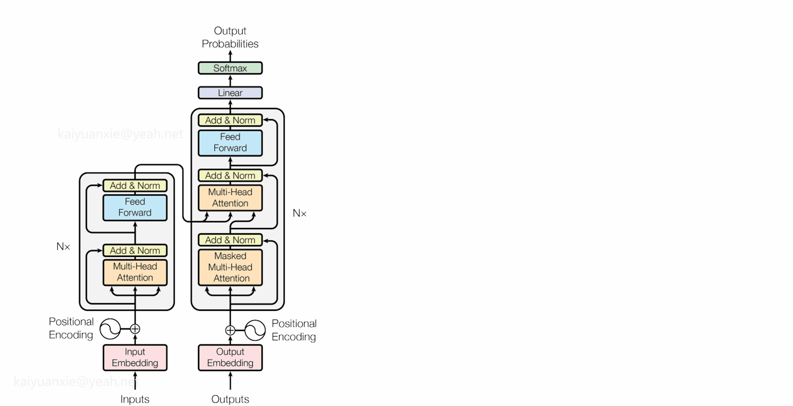
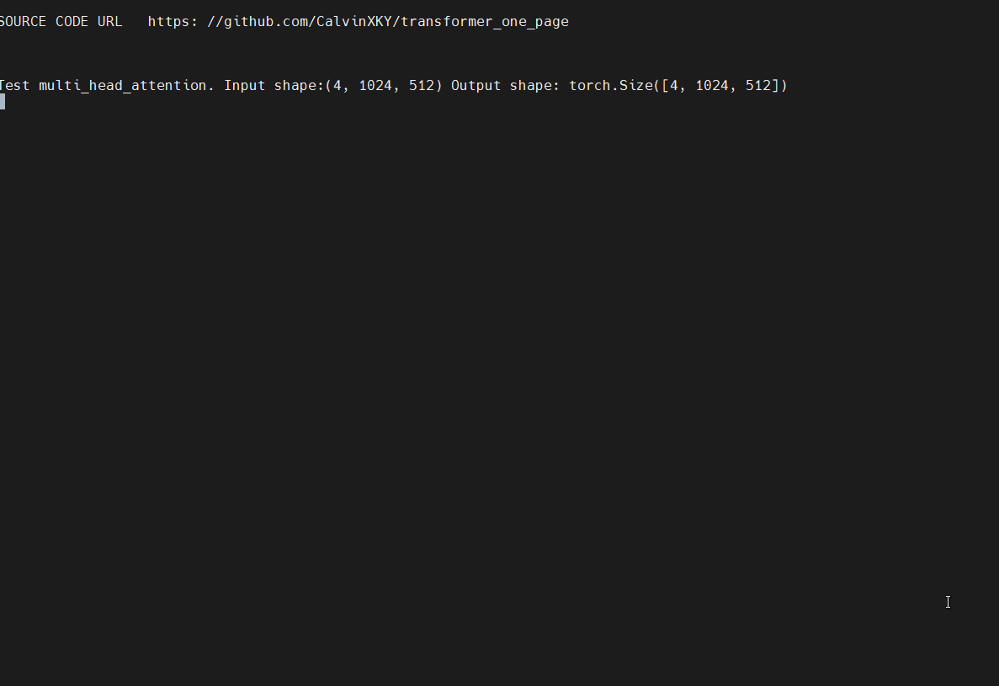

# Transformer One Page
Coding the transformer model architecture in one page for tutorial. Try to implement the model by PyTorch simply and clearly.

You'd better read the transformer paper before you coding.
The original paper: [Attention Is All You Need](https://arxiv.org/pdf/1706.03762.pdf)

## Coding Steps

<p align="center">

</p>

Step1: Implement sub modules:
* Embedding
* Positional Encoding
* Multi Head Attention (Key)
* Position wise Feed Forward 
* Encoder Layer 
* Decoder Layer 
* Generator

Step2: Build Nx Layers 
* Encoder
* Decoder

Step3: Assemble
* Transformer

## Tests for key modules
Requirements：
* torch>=1.13

There are three tests at the end of the code.
```python
if __name__ == "__main__":
    test_multi_head_attention()
    test_positional_encoding()
    test_transformer()
```

Run as follows
```python
python transfomer.py
```

Result:

<p align="center">

</p>
